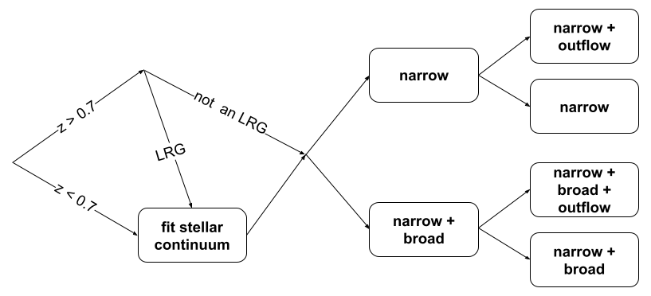

# nburst_fittingscript
Running this script requires knowledge of Nbursts, GDL, IDLAstro, and several stellar templates. Please see "Installing dependencies" to learn how to use Nbursts. 

This spectral fitting code proceeds as follows: 

We begin by dividing sources into two groups: $z > 0.7$ and $z < 0.7$. All sources with $z < 0.7$ are fit with a stellar continuum. If a source has $z > 0.7$, we check whether or not it is a Luminous Red Galaxy (LRG) according to the criteria defined in <a href = "https://arxiv.org/abs/1508.04473"> Dawson+2016</a> and <a href = "https://ui.adsabs.harvard.edu/abs/2020RNAAS...4..181Z/abstract"> Zhou+2020</a>. If the source is classified as an LRG, we fit its stellar continuum. Then, for all sources, we apply both a narrow line and a narrow line and broad line profile. 

We first fit each source with a narrow line profile which we start with a FWHM of 34 km/s and limit to 64 km/s. We start our broad line profile fit at the same FWHM, but enforce that the FWHM of the broad line fit must fall between 1.5 and 5 times the FWHM of the narrow line fit. Assuming that our broad line FWHM falls within this range, we compare the quality of the broad line and narrow line fits by inspecting either H𝞪, H𝛃, H𝞬, H𝛿, or MgII]𝝀2803, depending on what lines fall in the wavelength range of our spectrum (3700-9000Å) and what is detected above 3σ. Assuming one of the aforementioned lines is detected in both models, we calculate the Bayesian Information Criterion (BIC; <a href = "https://www.jstor.org/stable/2958889">Schwarz 1978</a>) over a 30Å window around the line for both fits. If ΔBIC > 2, we take the difference between the fits to be significant and assume the fit with the lower BIC value is the best fit. Otherwise, we assume there is no empirical difference between the models and apply a narrow line only fit. 

If one of the models does a better job fitting the emission lines than the other, such that an emission line is detected in one model but not the other, we take the model that detected the emission line to be the best fit. 

Then, we inspect the H3 Gauss-Hermite polynomial of the best fit. If H3 is negative, we add an outflow component to the previously determined best fit profile. If [OIII]𝝀5008 is significantly detected, we compute the BIC over a 30Å window around [OIII]𝝀5008 for both the fit with the added outflow component and the fit without.  If [OIII]𝝀5008 is not significantly detected, we do not add an outflow component. If the BIC of the fit with the outflow component and the BIC of the fit without differ by > 6, we take the fit with the lower BIC to be the best fit. Otherwise, we consider the outflow component to be extraneous. 

Once a best fit is determined for all sources, we inspect the narrow line velocity dispersion values of each source. If any of the sigmas are hitting the maximum narrow line velocity dispersion set by the user, we rerun those sources, doubling the maximum allowed narrow line sigma. This process is allowed to repeat three times before the fit will be returned with a narrow line velocity dispersion equivalent to the boundary condition. 

## Installing dependencies 
To run this code, Nbursts must be installed via Bitbucket. An <a href="https://www.atlassian.com/try/cloud/signup?bundle=bitbucket">Atlassian</a> account is required to do this. If this is your first time using Bitbucket, remember to set up an API token on your local machine! 

While in the Nbursts directory, run <code> git switch autofit </code> to ensure you're on the proper and most updated branch. 

Alternatively, you can grab an <b>unmaintained</b> version of Nbursts from me <a href="https://github.com/cassiemetzger/NBURSTS"> here</a>. 

Once Nbursts is installed, <a href = "https://gal-04.voxastro.org/~chil/Data/NBursts_models/template/">stellar population templates </a> must be downloaded. For this code, you'll need: 
<ul> 
    <li><code>pegase.hr/newgrid2_*</code></li>
    <li><code> pegase.hr/MILES/</code></li>
    <li><code> Vazdekis</code></li>
    <li><code> XSL</code></li>
</ul>
You'll want to place these templates in some folder along your Nbursts path. For instance, both Nbursts and a folder called <code>stellar_templates</code> are at the same level on my machine. 

Now, you'll want to install <code>IDLAstro</code>. 
Run <code>clone git://github.com/wlandsman/IDLAstro.git</code>. 
I placed this folder at the same level as Nbursts and stellar_templates. 

Finally, we need to set up GDL.

If you don't have it already, install <a href="https://www.macports.org/install.php">MacPorts</a>. 
Run <code>sudo port selfupdate</code> to ensure everything is up-to-date (and test that the installation was successful). 
Then, run <code>sudo port install gnudatalanguage </code>. 
Type <code>gdl</code> to test if GDL is operational. 

Then, to connect GDL and Nbursts, create a directory in your home called <code>.idl</code>. Within that directory, create a file called <code>start.pro</code>. Within <code>start.pro</code>, write the following: 

<code>on_error,2
  !path=!path+':'+EXPAND_PATH('+/Users/f007znp/Research/idlastro/')+$
              ':'+EXPAND_PATH('+/Users/f007znp/Research/nbursts/')
  device,retain=2,decomposed=0 </code>
  
Change the paths for <code>IDLAstro</code> and Nbursts as necessary. 

At the same level as Nbursts and stellar_templates, create a directory called "pro" and one called "processed". This is where your fitting inputs and outputs will go. 

## Run a test fit 
To confirm that everything is working, let's run a test. 

Navigate into your /pro/ directory and run <code>gdl start.pro</code>. You should see a number of files being compiled. Once this is completed, try opening a graphics window: <code>window,0,xs=1500,ys=600 & loadct,39</code>. 

Now, we'll download one SDSS spectrum as practice. We'll choose a file with <code>PLATE=1751 MJD=53377 FIBERID=147</code> and perform a three component fit (stellar continuum, narrow line, broad line). 

<code>get_process_sdss,1751l,53377l,147l,/plot,nlosvd=3,emexcl=0,emlt1=[1],emlt2=[2],$ start=[0,100,0,80,0,400,3000,-1.2],/force_sigma,lammin=3700,lammax=9000,$ degree=2,mdegree=5,$ path_ssp='/Users/f007znp/Research/stellar_templates/XSL/Kroupa/',$ prefix='SB_',suffix='_XSL_Kroupa_PC.fits'</code>

Let's break this call down: 

<code>/plot</code>: Plots the fit 

<code>nlosvd</code>: The number of components in the fit (in this case, 3). 

<code>emexcl</code>: The component assigned to the stellar continuum

<code>emlt1</code>: The component assigned to the narrow line

<code>emlt2</code>: The component assigned to the broad line

<code>start</code>: The start vector. It is ordered as follows: [starting velocity of component 1, starting sigma of component 1, velo of component 2, sigma of component 2, velo of component 3, sigma of component 3, age, metallicity]. The velocity and velocity dispersion are described in km/s. The age is in Myrs. 

<code>force_sigma</code>: This forces Nbursts to use the sigmas you set in your start vector. Without it, default values are used. 

<code>lammin, lammax</code>: Descibe the wavelength range over which you want to apply the fit 

<code>degree</code>: The degree of the additive Legendre polynomial used to correct the template continuum. You can set degree=-1 to remove the stellar continuum

<code>mdegree</code>: The degree of the multiplicative Legendre polynomial.

The rest of the call tells nbursts what stellar template to use and where to find it. 

This spectrum will automatically be downloaded into processed/SDSS_BOSS. The output file with the fit information will be stored in pro/SDSS_BOSS/results. 

## Fit multiple files as once
To fit multiple SDSS files at one time, you'll need to create a file that contains the location of the spectrum and the plate number of the spectrum, separated by a tab. 
For example, the first few lines might look like: 

<code> /Users/f007znp/Research/processed/SDSS_BOSS/spec-015059-59199-4555598157.fits 15059
/Users/f007znp/Research/processed/SDSS_BOSS/spec-7095-56625-0722.fits 7095
/Users/f007znp/Research/processed/SDSS_BOSS/spec-015239-59293-6036976581.fits 15239
</code>

Next, you'll want to add the survey's name and <code>inptable</code> to your call as follows: 

<code>process_survey,'sdss',inptable='../IMBH/sdss_files.txt',/plot,nlosvd=3,emexcl=0,emlt1=[1],emlt2=[2],start=[0,100,0,80,0,400,3000,-1.2],/force_sigma,lammin=3700,lammax=9000,degree=2,mdegree=5,path_ssp='/Users/f007znp/Research/stellar_templates/XSL/Kroupa/',prefix='SB_',suffix='_XSL_Kroupa_PC.fits'</code>

### Other useful details 
A narrow line only fit will look like this: <code>nlosvd=2,emexcl=0,emlt1=[1],start=[0,100,0,80,3000,-1.2]</code>

A narrow line + outflow fit will look like this: <code>nlosvd=3,emexcl=0,emlt1=[1,2],start=[0,100,0,80,0,150,3000,-1.2]</code>

A narrow line, broad line, and outflow fit will look like this: <code>nlosvd=4,emexcl=0,emlt1=[1,2], emlt2=[2], start=[0,100,0,80,0,150,0,400,3000,-1.2]</code>

To fit Gauss-Hermite polynomials, you can add in the keyword <code>moments</code>. Set <code>moments=4</code> to fit H3, H4 and set <code>moments=6</code> to fit H3,H4,H5,H6. 

You can specify the output path of the file with <code>outpath=''</code>

You can fit only a specific range of lines in your input text file with <code> imin = , imax= ,</code>. For example, <code>imin=1193,imax=1193</code> will fit only line 1193 of the input file. 

## Running the code 
You'll want to begin by running <code>prepare_file.py</code> to retrieve all necessary SDSS and DESI information. To run this file, you'll need to have <a href = "https://www.sdss4.org/dr17/spectro/spectro_access/"><code>specObj-dr17.fits</code></a>, <a href="https://sdss.org/dr19/data_access/get_data/"><code>spAll-v6_1_3.fits</code>, and <a href = "https://data.desi.lbl.gov/doc/organization/"><code>zall-tilecumulative-iron.fits</code></a>. <b>Please change the paths in the file to match the location of these files on your machine.</b> Then, run <code>prepare_file.py</code> by entering
<code> python prepare_file.py {YOUR INPUT FILE}.fits {YOUR OUTPUT FILE}.fits </code>

Next, to retrieve SDSS data, run <code>sdss_download.py</code>. You can do this by entering <code>python sdss_download.py {YOUR PREPARED FILE}.fits</code>. <b>Be sure to edit the <code>SDSS_DESTINATION</code> parameter so your data can be located</b>. 

Given the download time of DESI data, you'll need to retrieve that on your own (sorry) :/ 

Now, you're ready to run <code>nburst_script.py</code>. To do so, enter <code>python nburst_script.py {YOUR PREPARED INPUT FILE} output.txt</code>.  